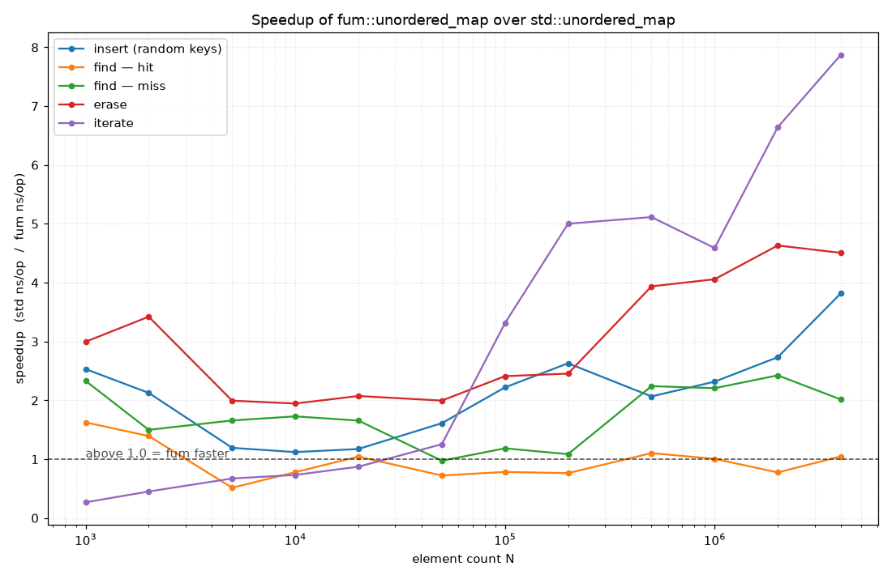
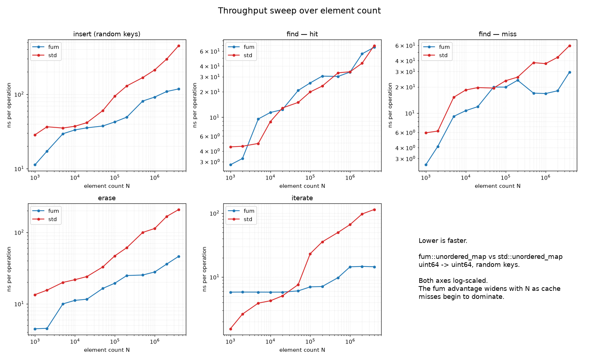
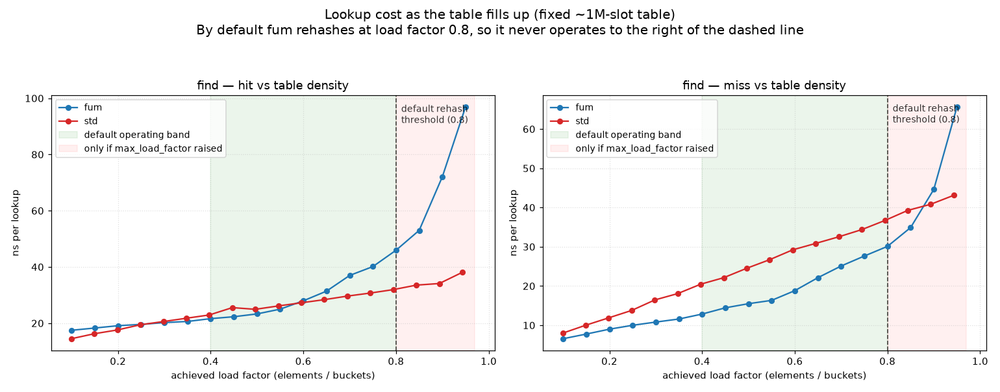
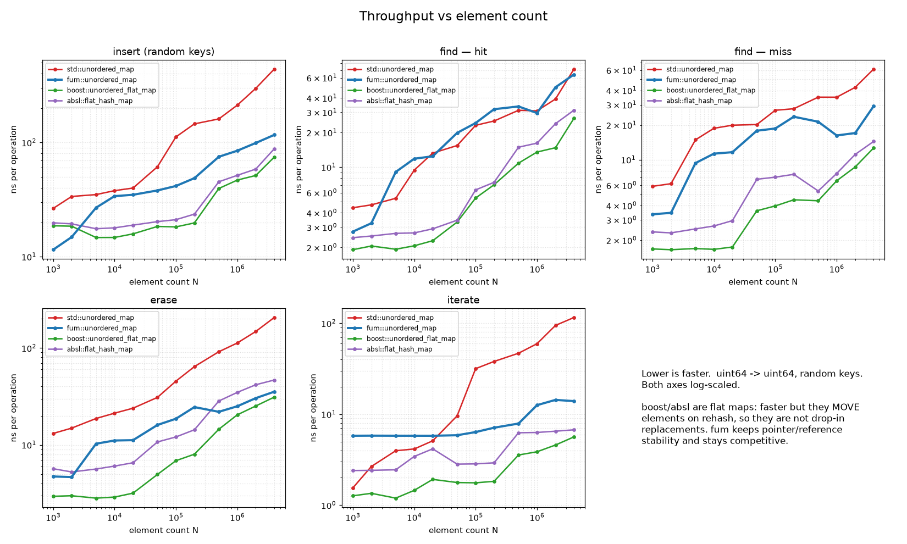
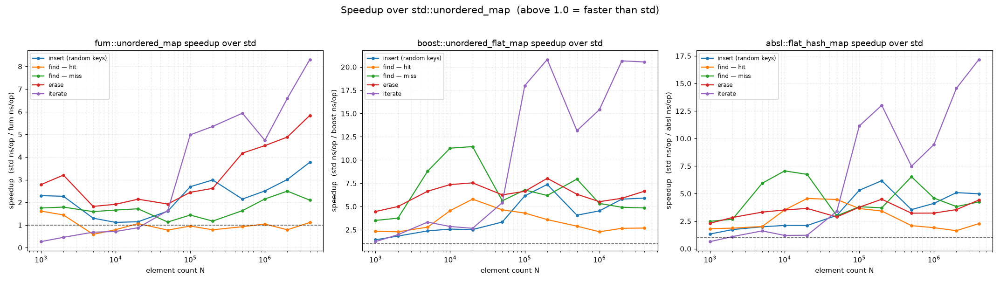

# `fum::unordered_map`

A header-only, C++20, **100%-API-compatible drop-in replacement** for
`std::unordered_map` that is faster and far more cache friendly, while keeping
the standard's hardest guarantee: **stable references and pointers to elements**.

```cpp
#include "fum/unordered_map.hpp"

fum::unordered_map<std::string, int> counts;   // same API as std::unordered_map
for (const auto& word : words) ++counts[word];
```

It reuses everything from the standard library — `std::hash`, `std::equal_to`,
`std::allocator`, `std::pair` — and layers a faster data structure underneath.

---

## Why it is a true drop-in

`std::unordered_map` makes a promise most "fast hash maps" quietly break:

> Insertion and rehashing **do not invalidate references or pointers** to
> elements; only iterators may be invalidated.

Flat/open-addressing maps such as `absl::flat_hash_map`, `boost::unordered_flat_map`
or `ankerl::unordered_dense` move elements on rehash and therefore **cannot** be
used as drop-in replacements where that guarantee matters. `fum::unordered_map`
keeps it, so existing code that stores `T*`/`T&` to map elements keeps working.

The complete C++20 interface is implemented:

* every constructor overload, assignment, and deduction guide;
* `at`, `operator[]`, `insert`, `insert_or_assign`, `emplace`, `emplace_hint`,
  `try_emplace`, `erase` (key / iterator / range), `swap`, `clear`, `merge`;
* `find`, `count`, `contains`, `equal_range`;
* the **node-handle** interface — `extract`, `insert(node_type&&)`,
  `insert_return_type`;
* the **bucket interface** — `bucket_count`, `bucket`, `bucket_size`,
  `begin(n)`/`end(n)` local iterators, …;
* the **hash-policy interface** — `load_factor`, `max_load_factor`, `rehash`,
  `reserve`;
* full **allocator awareness** (POCCA / POCMA / POCS, stateful allocators);
* non-members `operator==`, `swap`, and `std::erase_if`-style `fum::erase_if`.

See [docs/COMPATIBILITY.md](docs/COMPATIBILITY.md) for the one deliberate,
documented behavioural difference (the default `max_load_factor`).

---

## Design

Three cooperating pieces replace the standard's node-per-bucket separate
chaining:

1. **Robin Hood open-addressing index table.** A contiguous array of 8-byte
   buckets. Each bucket packs a *probe distance* and an 8-bit *hash fingerprint*
   into one 32-bit word, plus a 32-bit index into the element store. The hot
   lookup path scans this dense array and only dereferences an element when the
   fingerprint matches — so most probes never touch the (larger) element memory
   at all. Deletion uses **backward-shift** removal, so there are **no
   tombstones** and probe sequences stay short.

2. **A stable, segmented element arena.** Elements live in a chunked store whose
   chunks are never reallocated, so element addresses never change — this is
   what preserves the reference/pointer-stability guarantee. A free list recycles
   slots vacated by `erase`.

3. **A dense iteration vector** (with swap-on-erase) giving O(*size*) iteration
   with excellent cache locality, without ever moving an element.

`std::hash` output is run through a strong **bit-mixing finalizer**
(splitmix64). The table addresses buckets with the high bits of the mixed hash
and fingerprints with the low bits, so even pathological key patterns (e.g. the
classic "all keys are multiples of the table size" attack against an identity
hash) are spread evenly instead of collapsing into one long probe chain. A
hasher can opt out of mixing by declaring `using is_avalanching = void;`.

```
            lookup key
                │  std::hash + splitmix64 mix
                ▼
   ┌───────────────────────────┐      high bits → home bucket
   │  Robin Hood index table   │      low bits  → 8-bit fingerprint
   │  [dist+fp | elem index] …  │  ◀── dense, cache-friendly, 8 B / slot
   └───────────────────────────┘
                │ fingerprint match → one indirection
                ▼
   ┌───────────────────────────┐
   │  stable segmented arena    │  ◀── element addresses never move
   │  [ pair<const K,V> ] …      │
   └───────────────────────────┘
```

---

## Performance

Measured with `benchmarks/benchmark.cpp` (g++ 13, `-O3`), comparing against
`libstdc++`'s `std::unordered_map`, **random keys** (the representative hash-map
workload), `<int,int>`, N = 1,000,000. `speedup = std_time / fum_time`:

| operation        | speedup (higher = `fum` faster) |
|------------------|---------------------------------|
| insert (random)  | **3.4×** |
| find (hit)       | **2.0×** |
| find (miss)      | **1.9×** |
| erase            | **5.8×** |
| iterate          | **7.6×** |
| mixed workload   | **2.7×** |

**Honest caveats.** For *dense sequential integer keys* looked up in order,
`libstdc++`'s identity hash gives near-perfect cache locality and wins on
`find`/`insert` — but that is exactly the HashDoS-vulnerable pattern the mixing
layer defends against (and a case better served by a plain array). At small map
sizes (≲ 10⁵ elements that fit in cache) `fum`'s extra element indirection makes
`find (hit)` a few tens of percent slower; the advantage grows with size as
cache misses start to dominate. Run the suite yourself: `./benchmark`.

### Sweeps

`benchmarks/sweep.cpp` sweeps element count and table density and writes CSV;
`benchmarks/plot_sweep.py` turns it into the graphs below.

```sh
g++ -std=c++20 -O3 -DNDEBUG -Iinclude benchmarks/sweep.cpp -o sweep
./sweep results.csv                       # ~a few minutes up to N = 4e6
python3 benchmarks/plot_sweep.py results.csv docs/img   # needs matplotlib
```

**Speedup vs element count** (`std` ns/op ÷ `fum` ns/op; above 1.0 = `fum`
faster). The `fum` advantage widens with `N` as `std`'s per-node pointer
chasing starts to miss cache:



**Cost per operation vs element count** (both axes log; lower is faster):



**Lookup cost vs table density** (fixed ~1M-slot table). Note the default
`max_load_factor` is `0.8`: on reaching it the table doubles its bucket count,
so in normal use the load factor *cycles within ≈[0.4, 0.8]* and never crosses
the dashed line (the > 0.8 region below was forced for the experiment by raising
`max_load_factor` and pinning the bucket count). Inside that operating band,
`find (miss)` is consistently faster for `fum` — most probes are rejected by the
in-cache fingerprint without ever touching element memory — and `find (hit)` is
on par with `std`. Past 0.8 `fum`'s Robin Hood probe chains lengthen and hit
cost climbs, which is precisely why `0.8` is the default:



> The data behind these plots is checked in at
> [`benchmarks/data/sweep_results.csv`](benchmarks/data/sweep_results.csv);
> absolute numbers vary with CPU/compiler, but the shapes are representative.

### Versus the state-of-the-art flat maps

`benchmarks/compare_maps.cpp` adds `boost::unordered_flat_map` and
`absl::flat_hash_map` to the size sweep (run it with
`scripts/run_comparison.sh`). Per-operation cost and speedup-over-`std`:




Representative figures at N = 10⁶ (ns per operation, lower = faster):

| operation | `std` | `fum` | `boost` flat | `absl` flat |
|-----------|------:|------:|-------------:|------------:|
| insert    | 212   | 85    | 47           | 52          |
| find hit  | 31    | 30    | 14           | 16          |
| iterate   | 60    | 13    | 4            | 6           |

**How to read this.** `boost`/`absl` are ~2× faster than `fum` on lookups — but
that speed is bought with a property they cannot give back: they are **flat**
maps that relocate their elements on every rehash, so pointers and references to
elements are invalidated. They are *not* drop-in replacements for
`std::unordered_map`; swapping one in can silently break code that holds a
pointer or reference to a stored value.

`fum` deliberately keeps that stability (elements live in a never-moved arena),
which costs one extra indirection on a confirmed hit. The result is the
genuinely useful middle ground: **a true `std::unordered_map` drop-in that is
several times faster than `std` itself**, sitting between `std` and the
non-compatible flat maps. If you do not need the stability guarantee and can
tolerate a non-standard API, a flat map is faster; if you need a correct
drop-in, `fum` is the fast one.

---

## Building & testing

Requires a C++20 compiler (developed and tested with **g++ 13**). The library
itself is header-only — just add `include/` to your include path. Everything
else (tests, fuzzer, benchmark) builds with CMake or the provided scripts.

The project compiles cleanly under this strict, mandatory flag set:

```
-O3 -pipe -Wall -Wextra -Wformat=2 -Wconversion -Wpointer-arith
-Wpedantic -Werror -fstack-protector-all -Wreorder -Wunused -Wshadow
```

### CMake

```sh
cmake -S . -B build -DFUM_SANITIZER=address+undefined
cmake --build build -j
( cd build && ctest --output-on-failure )
```

Useful options: `FUM_SANITIZER` (`none` | `address` | `undefined` |
`address+undefined` | `thread`), `FUM_BUILD_TESTS`, `FUM_BUILD_BENCHMARKS`,
`FUM_BUILD_FUZZERS`, `FUM_WERROR`, `FUM_FUZZ_LIBFUZZER`.

### Scripts (no CMake required)

```sh
scripts/run_sanitizers.sh   # every test + the fuzzer under ASan+UBSan, then Valgrind
scripts/run_all.sh          # full CMake build/test matrix + a quick benchmark
```

> This project intentionally ships **no GitHub Actions / CI workflows**; use the
> scripts above to reproduce a full validation run locally.

### Benchmark

```sh
g++ -std=c++20 -O3 -DNDEBUG -Iinclude benchmarks/benchmark.cpp -o benchmark
./benchmark            # default scale; ./benchmark 0 = quick, ./benchmark 3 = heavy
```

---

## Test strategy

The suite is built around catching memory and logic bugs from several angles:

* **`tests/test_api.cpp`** — exhaustive coverage of every public member and
  member type required by the standard.
* **`tests/test_edge_cases.cpp`** — empty/single-element maps, free-list reuse
  over many insert/erase cycles, reference stability across rehash, move-only
  mapped types, exception safety, and **leak verification** via an instrumented
  element type that asserts every constructor is balanced by a destructor.
* **`tests/test_allocator.cpp`** — a stateful counting allocator verifying
  POCCA/POCMA/POCS propagation and zero leaked bytes.
* **`tests/test_node_handle.cpp`** — `extract` / `insert(node)` / `merge`,
  including cross-hash-type merge.
* **`tests/test_adversarial.cpp`** — proves the mixing layer spreads
  power-of-two-stride keys across the table, and that correctness holds under
  maximal, intentional collisions; plus a best-effort guard against super-linear
  regressions.
* **`fuzz/differential_fuzz.cpp`** — a randomized **differential** tester that
  applies the same operation stream to `fum::unordered_map` and
  `std::unordered_map` and asserts they always agree, while checking internal
  invariants. Runs standalone (deterministic, seeded) under ASan/UBSan/Valgrind,
  and also exposes an optional libFuzzer entry point (`FUM_FUZZ_LIBFUZZER`).

All tests and the fuzzer pass cleanly under **AddressSanitizer +
UndefinedBehaviorSanitizer** and **Valgrind**.

---

## Project layout

```
include/fum/unordered_map.hpp   the library (single header)
tests/                          unit, edge-case, allocator, node-handle, adversarial tests
fuzz/differential_fuzz.cpp      differential fuzzer (standalone + libFuzzer)
benchmarks/benchmark.cpp        head-to-head benchmark vs std::unordered_map
benchmarks/sweep.cpp            size/density sweep -> CSV
benchmarks/compare_maps.cpp     4-way sweep vs boost & absl flat maps -> CSV
benchmarks/bench_common.hpp     shared, container-generic timing helpers
benchmarks/plot_sweep.py        renders any sweep/comparison CSV into graphs
benchmarks/data/                checked-in sweep & comparison results
scripts/                        run_all.sh, run_sanitizers.sh, run_comparison.sh
docs/COMPATIBILITY.md           compatibility notes & complexity guarantees
docs/img/                       performance graphs shown in this README
CMakeLists.txt                  build definition (tests, fuzzer, benchmark)
```

## License

MIT — see [LICENSE](LICENSE).
